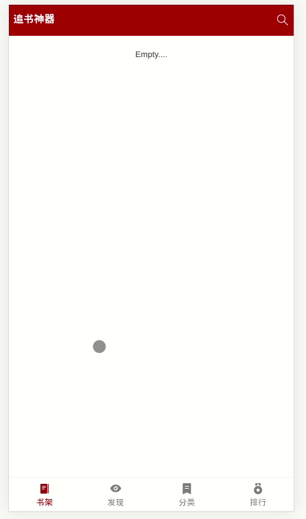
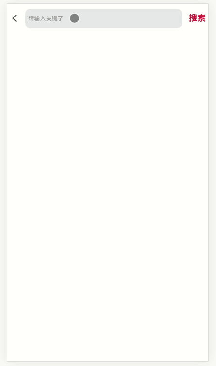

<h1 align="center">Welcome to funReader 👋</h1>
<p align="center">
	<a href="https://imgchr.com/i/em0IRs"></a>
</p>
<p>
  
</p>

> 在线小说 web app

在线预览 👉：http://101.132.135.151

## install

```sh
npm install
```

## How to use

```sh
npm run dev
```

## Feature

### Loading、屏幕滑动删除事件



### 换肤、目录、日夜模式、字体大小切换


### 搜索自动补全



## Preview


## Author

👤 **Yeoman Li**

* Github: [@YeomanLi](https://github.com/YeomanLi)

## 🤝 Contributing

Contributions, issues and feature requests are welcome!<br />Feel free to check [issues page](https://github.com/YeomanLi/funReader/issues).

## Show your support

Give a ⭐️ if this project helped you!

***
_This README was generated with ❤️ by [readme-md-generator](https://github.com/kefranabg/readme-md-generator)_